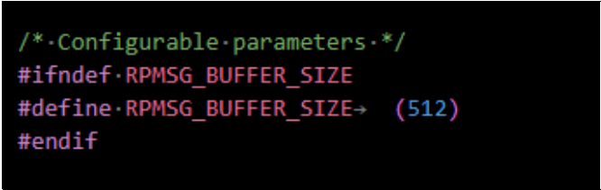
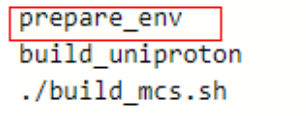
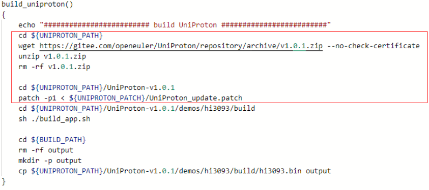
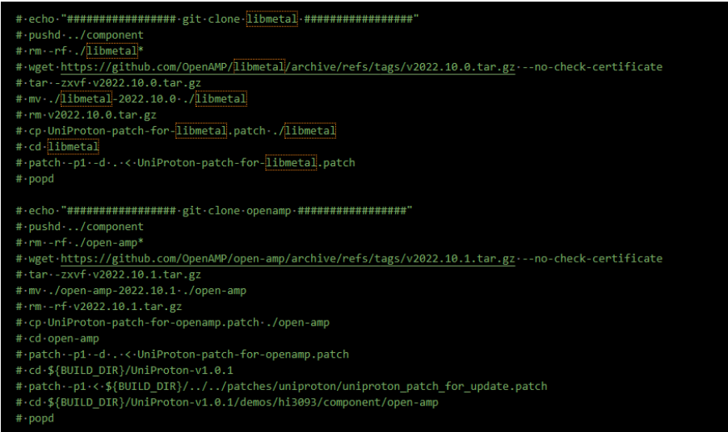
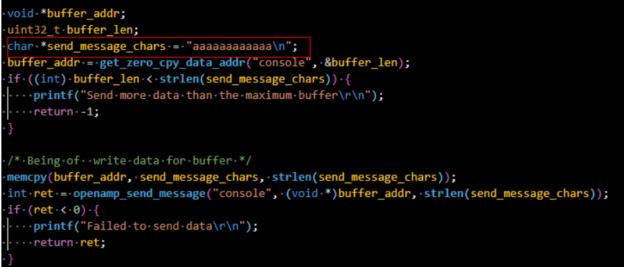
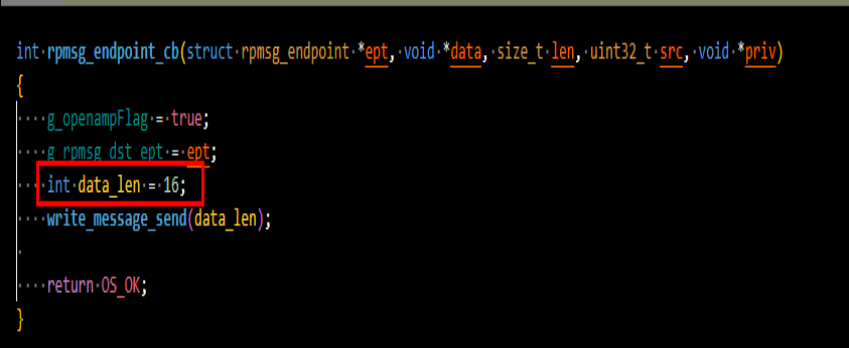

# 1.概述

该文档提供混合部署方案中驱动隔离方案、支持openAMP中buffer大小配置、混合部署非实时侧接口说明以及混合部署下电的使用指南等说明。

多系统混合部署框架请参考如下链接：https://embedded.pages.openeuler.org/openEuler-22.03-LTS-SP3/features/mcs.html。

# 2.指南参考

## 2.1 混合部署非实时侧接口说明

| 1.openamp_init | 介绍 |
|-----|-----|
| 函数名 | oepnamp_init |
| 函数原型 | int openamp_init(struct client_os_inst *client) |
| 输入 | client_os_inst 结构体 |
| 输出 | 返回值为int类型，返回值小于0，代表初始化失败 |
| 备注 | 该函数实现openamp初始化，包含从核处理器生命周期的初始化、把从核镜像加载到指定内存地址，对从核处理器进行上下电等操作。 |

| 2.openamp_create_endpoint | 介绍 |
|-----|-----|
| 函数名 | openamp_create_endpoint |
| 函数原型 | int openamp_create_endpoint(const char *ep_name, rpmsg_ept_cb cb) |
| 输入 | ep_name：字符串类型，代表主从核通信通道的别名；cb：代表ep_name通道的回调函数，处理从核发送过来的消息 |
| 输出 | 返回值为int类型，返回值小于0，代表注册失败 |
| 备注 | 该函数实现对主从核通道进行注册 |

| 3.openamp_create_pty_endpoint | 介绍 |
|-----|-----|
| 函数名 | openamp_create_pty_endpoint |
| 函数原型 | int openamp_create_pty_endpoint (const char *ep_name,rpmsg_ept_cb cb) |
| 输入 | ep_name：字符串类型，代表主从核通信通道的别名；cb：代表ep_name通道的回调函数，处理从核发送过来的消息 |
| 输出 | 返回值为int类型，返回值小于0，代表注册失败 |
| 备注 | 该函数实现对主从核通道进行注册，区别在该函数带有虚拟串口打印输入功能；相同通道名字的通信endpoint只能够调用一次，不能够重复创建相同名字的通道。 |

| 4.openamp_destroy_endpoint | 介绍 |
|-----|-----|
| 函数名 | openamp_destroy_endpoint |
| 函数原型 | int openamp_destroy_endpoint(const char *ep_name) |
| 输入 | ep_name：字符串类型，代表主从核通信通道的别名 |
| 输出 | 返返回值int类型，返回值等于0，代表销毁成功。 |
| 备注 | 该函数实现对已经存在的通道进行销毁；相同通道名字的通信endpoint只能够调用一次，不能够重复创建相同名字的通道。 |

| 5.openamp_destroy_pty_endpoint | 介绍 |
|-----|-----|
| 函数名 | openamp_destroy_pty_endpoint |
| 函数原型 | int openamp_destroy_pty_endpoint(struct pty_ep_data *pty_ep) |
| 输入 | pty_ep：pty_ep_data结构体类型，代表销毁的通道的结构体。 |
| 输出 | 返回值int类型，返回值等于0，代表销毁成功。 |
| 备注 | 该函数实现对已经存在带有虚拟串口的通道进行销毁。 |

| 6.openamp_deinit | 介绍 |
|-----|-----|
| 函数名 | openamp_deinit |
| 函数原型 | int openamp_deinit(struct client_os_inst *client) |
| 输入 | client_os_inst：结构体。 |
| 输出 | 返回值int类型，返回值等于-1，代表销毁openamp生命周期失败。 |
| 备注 | 该函数实现对openamp进行销毁，包含对从核生命周期以及申请的内存资源进行释放。 |

| 7.get_zero_cpy_data_addr | 介绍 |
|-----|-----|
| 函数名 | get_zero_cpy_data_addr |
| 函数原型 | void* get_zero_cpy_data_addr(const char *ep_name, int *buffer_len) |
| 输入 | ep_name：字符串类型，代表主从核通信通道的别名；buffer_len：输入的buffer_len的值（函数内部会赋值），返回当前buffer可填充数据的最大值。 |
| 输出 | void *：返回可用buffer的首地址；buffer_len：返回当前buffer可填充数据的最大值。 |
| 备注 | 该函数返回可用buffer的首地址。 |

| 8.openamp_send_message | 介绍 |
|-----|-----|
| 函数名 | openamp_send_message |
| 函数原型 | int openamp_send_message(const char *ep_name, void *data, int data_len) |
| 输入 | ep_name：字符串类型，代表主从核通信通道的别名；data：代表buffer的首地址；data_len：代表buffer中已经实际填充数据的长度。 |
| 输出 | 返回值为int类型，小于0代表发送失败。 |
| 备注 | 调用该函数时，由客户自行保证参数len与发送data数据的长度一致，并且len值要小于等于buffer的长度减去消息头（16字节）。 |

| 9.openamp_endpoint_ready | 介绍 |
|-----|-----|
| 函数名 | openamp_endpoint_ready |
| 函数原型 | int openamp_endpoint_ready(const char *ep_name) |
| 输入 | ep_name：字符串类型，代表主从核通信通道的别名。 |
| 输出 | 返回值为int类型，等于1代表通道创建完成。 |
| 备注 | 该函数一直调用，如果超时15us，返回创建通道失败。 |

## 2.2 混合部署实时侧接口说明

**UniProton混合部署接口说明**

| 10.rpmsg_send_offchannel_nocopy_hwi | 介绍 |
|-----|-----|
| 函数名 | rpmsg_send_offchannel_nocopy_hwi |
| 函数原型 | rpmsg_send_offchannel_nocopy_hwi(struct rpmsg_endpoint *ept,  const void *buffer_addr, int data_len) |
| 输入 | ept：rpmsg_endpoint: 代表通信通道的别名结构体；buffer_addr：代表待发送数据的首地址；data_len：代表buffer中已经填充数据的长度。 |
| 输出 | 返回值为int类型，小于0代表发送失败。 |
| 备注 | - |

| 11.rpmsg_get_tx_payload_buffer | 介绍 |
|-----|-----|
| 函数名 | rpmsg_get_tx_payload_buffer |
| 函数原型 | void *rpmsg_get_tx_payload_buffer(struct rpmsg_endpoint *ept, uint32_t *len, int wait); |
| 输入 | ept：rpmsg_endpoint，代表通信通道的别名结构体；len：代表buffer返回的可写的最大值；wait：代表如果当前没有空闲buffer，是否等待空闲buffer；wait = 1代表等待。 |
| 输出 | 返回值为void *，返回buffer的首地址。 |
| 备注 | - |

## 2.3 混合部署IPC通信Buffer大小配置

**步骤1**：修改`hi-mpu/open_source/open-amp/lib/include/openamp/rpmsg_virtio.h`头文件中`RPMSG_BUFFER_SIZE`宏：可修改的最大值为 1024 ，如图2-1所示。

**图2-1** 单条buffer数据大小配置



**步骤2** 针对UniProton的混合部署，还需要如下修改：

1. 重新执行[《openEuler+UniProton混合部署方案编译运行指南》](./openEuler+UniProton混合部署方案编译运行指南.md)中2.1所介绍的快速构建，编译出镜像包。

2. 针对于UniProton中buffer大小可配置，修改头文件`hi-mpu/src/real_time/UniProton/UniProton-v1.0.1/demos/hi3093/component/open-amp/lib/include/openamp/rpmsg_virtio.h`中RPMSG_BUFFER_SIZE变量；修改完成后，执行如下命令:
    ```	
    cd mpu_solution/build/build_uniproton
    ./build_uniproton.sh
    ```

    **注意点**：

    - `hi-mpu/src/real_time/UniProton/UniProtonv1.0.1/demos/hi3093/component/open-amp/lib/include/openamp/rpmsg_virtio.h`中RPMSG_BUFFER_SIZE大小要与`hi-mpu/open_source/open-amp/lib/include/openamp/rpmsg_virtio.h`中RPMSG_BUFFER_SIZE大小保持一致。

    - 执行`build_uniproton.sh`之前，需要注释`build_uniproton.sh`脚本中如图2-2画红色方框所示。需要注释`build_uniproton.sh`脚本中如图2-3画红色方框所示。需要注释`hi-mpu/src/real_time/UniProton/UniProton-v1.0.1/demos/hi3093/build中build_openamp.sh`脚本中如图2-4所示。
        
        **图2-2** 脚本注释函数示意图

        

        **图2-3** build_uniproton 函数注释示意图

        

        **图2-4** UniProton 中 build_openamp.sh 脚本注释示意图

        
       
3. 重新执行[《openEuler+UniProton混合部署方案编译运行指南》](./openEuler+UniProton混合部署方案编译运行指南.md)中3.1混合部署烧写启动指南 章节内容。

    **注意点**

    -	生成组件位于`build/build_uniproton/output`目录下。

    -	需要修改rpmsg_main与hi3093.bin执行权限，如果不修改，导致执行失败。
        ```
        ./rpmsg_main -c 3 -t hi3093.bin -a 0x93000000。
        ```

    -	如果需要验证buffer是否修改正确，需要修改以下内容：
        - 通过修改字符串，判断该字符串是否成功打印。（未打印成功，显示send more data than the maximum buffer，说明发送的数据超过最大缓冲区。）
            - 例如缓冲区长度修改为500，修改`send_message_chars`为一个含有500个a字符的字符串（通过循环修改）。
        - 图2-5显示`hi-mpu/open_source/mcs/rpmsg_pty_uniproton/rpmsg_main.c`中画红色方框：（其他系统如libck和baremetal同理修改mcs目录下对应的rpmsg_main.c）。
        
            **图2-5 代码修改示意图**

            

        - UniProton代码需要修改处如下图2-6红框中所示：
        `mpu_solution/src/real_time/UniProton/UniProtonv1.0.1/demos/hi3093/apps/openamp/rpmsg_service.c`
        
            **图2-6** UniProton侧代码修改示意图

            
        
## 2.4 混合部署驱动隔离指南

**前置条件：**

1. 系统安装python3。

2. 下载release代码包并解压。

**隔离步骤如下：**

**步骤1** 修改`hi-mpu/build/build_rtos`现有的*.dts文件。

    说明：
    *.dts仅支持hi3093_mcs_2with2.dts与hi3093_mcs_3with1.dts

**步骤2**: 打开现有*.dts文件，增加或者修改设备数节点的属性值（支持隔离的驱动外设参考以下[须知](#chapter1)），属性含义如下说明：

1. domain参数值说明：0x0——非实时侧使用；0x1——代表实时侧使用。
2. channel参数值说明：<0x0 0x7>——代表通道0到通道7赋予实时侧使用。
3. 仅支持数值小于10的数字。

**步骤3** 修改完成后，进入mpu_solution/build/build_dts目录下。

- 如果修改hi3093_mcs_2with2.dts，则执行如下命令。
    ```
    `./convert_dts.sh oe_bm`
    ```

- 如果修改hi3093_mcs_3with1.dts，则执行如下命令。
    ```
    ./convert_dts.sh oe_libck
    ```

<a name="chapter1"></a>

**须知**

现有设备树节点uart、gmac、timer、gpio、i2c、spi、watchdog、dmac、localbus支持驱动隔离，其中只有dmac支持channel。其他驱动仅支持domain。

## 2.5 混合部署下电指南

在混合部署方案中，执行混合部署升级指南操作后，需要等待10s，然后在执行rpmsg_main的串口中，执行Ctrl+C操作，就可以将从核CPU正常下电。

**须知**

不要在执行rpmsg_main文件的串口之外，或者正在进行发送接收数据时，执行Ctrl+C操作，进行从核下电。

## 2.6 混合部署通信流程

### 2.6.1 主核调用流程

**步骤1** openamp_init
    
    功能：实现openamp初始化，包含从核处理器生命周期的初始化、把从核镜像加载到指定内存地址，对从核处理器进行上下电等操作。

**步骤2** openamp_create_endpoint或者openamp_create_pty_endpoint
    
    功能：注册通道端点。

**步骤3** openamp_endpoint_ready
    
    功能：实现等待两侧端点创建完成。

**步骤4** 在回调函数endpoint_cb中调用get_zero_cpy_data_addropenamp_send_message。
    
    1. 调用get_zero_cpy_data_addr获取buffer的首地址；
    2. 获取的buffer首地址填写数据；
    3. 调用openamp_send_message发送数据。

**步骤5** openamp_deinit
    功能：该函数实现对openamp进行销毁，包含对从核生命周期以及申请的内存资源进行释放；同时调用openamp_destroy_endpoint销毁端点。

### 2.6.2 从核调用流程（以UniProton为例）

**步骤1** UniProton的初始化

**步骤2** rpmsg_create_ept
    
    功能：注册通道端点，传入通道名和接收回调cb函数。

**步骤3** 发送数据
    
    1. 调用rpmsg_get_tx_payload_buffer获取buffer的首地址；
    2. 获取的buffer首地址填写数据；
    3. 调用rpmsg_send_nocopy发送数据。

**步骤4** 接收数据。
    
    在接收回调cb函数内，接收数据。

## 2.7 混合部署注意事项
在混合部署框架中，注意如下事项：
- 下电过程中，出现No buffer is available for shutdown现象时，说明openAMP中共享buffer已经被使用完，无法发送消息下从核cpu的电；因此需要对单板重新上下电（硬重启）。
- 出现Send more data than the maximum buffer此现象时，说明openAMP中共享buffer已经被使用完，openEuler侧需要重新调get_zero_cpy_data_addr函数获取buffer首地址，直到出现返回首地址不为NULL，后续才可能正常发消息。
- 电功能仅支持核间通信mcs。