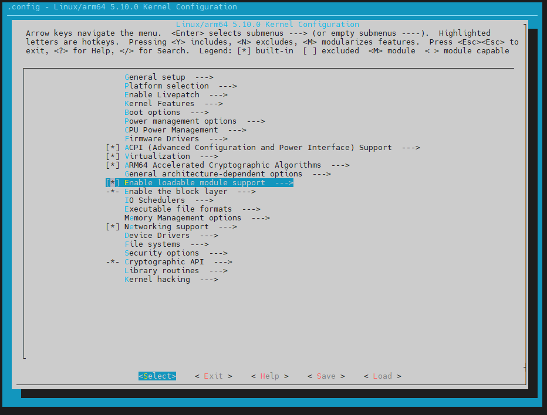
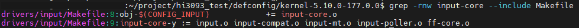
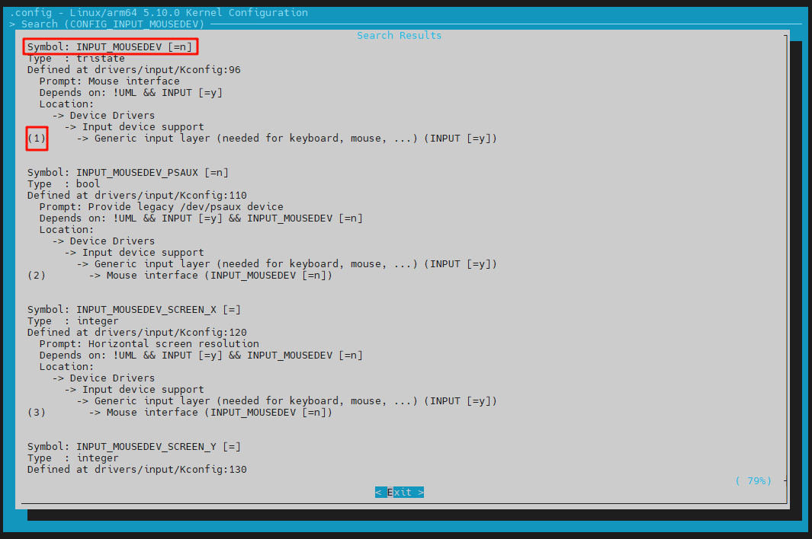
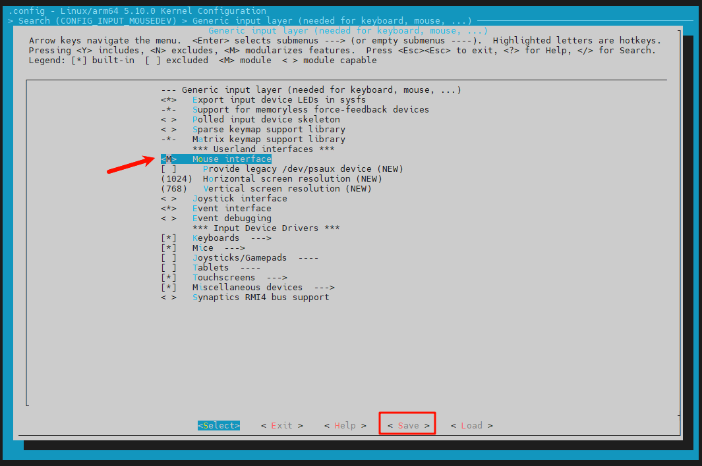
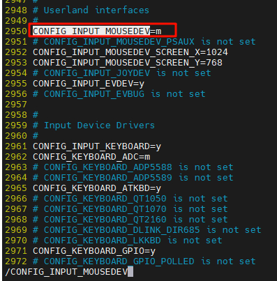
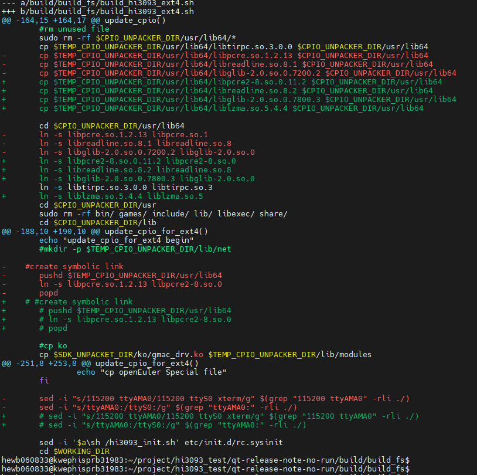

# openEuler24.03系统QT组件适配指南

## 1. 概述

本指南提供了构建带有QT接口的openEuler24.03系统镜像的详细步骤。生成此镜像的过程与生成openEuler镜像的方法大体相同，本指南将重点介绍其中的关键差异。如需了解构建过程的其他详细信息，例如编译前的环境准备、分模块编译等内容，请参考[《openEuler系统编译运行指南》](./openEuler系统编译运行指南.md)。

依据本指南得到openEuler文件系统、镜像输出件，支持QT的内核配置文件，以及最终Hi3093镜像包，均可在 [https://gitee.com/bbgod118/Hi3093-image-file.git](https://gitee.com/bbgod118/Hi3093-image-file.git) 仓库下载。

## 2. EMMC镜像构建

### **步骤1**： 依次执行如下命令，初始化oebuild工作目录以及构建分支代码：
```
oebuild init buildwork -b openEuler-24.03-LST
cd /home/user/buildwork
oebuild update
```

<span style="color:#0066cc;">**须知**</span>
1. 假设执行路径位于/home/user/，执行后根据提示进入对应目录：执行路径可以根据自己需求修改执行路径。
2. buildwork：存放目录。
3. openEuler-24.03-LST为当前支持本构建的源码分支。
4. 执行oebuild update完成后，将在 /home/user/buildwork/src/ 目录下载好主构建源码，并初始化构建虚拟环境。

### **步骤2**： 删除qt组件的硬件支持代码（默认没有hi3093）：
```
cd ./src/yocto-meta-openeuler/.oebuild/features/
vi openeuler-qt.yaml
```

将openeuler-qt.yaml文件中`support: raspberrypi4-64|ok3568|ryd-3568|x86-64`内容删除。


<span style="color:#0066cc;">**须知**</span>
- 未来oebuild版本会对于硬件支持情况更新，如更新后文件内无该代码，或增加hi3093支持，可不做修改。

### **步骤3**： 进入oebuild工作目录，执行如下命令进行创建对应的编译配置文件：
```
oebuild generate -p hi3093 -f openeuler-qt -d hi3093-qt
```

<span style="color:#0066cc;">**须知**</span>
1. -p hi3093：需选定硬件参数hi3093。
2. -f openeuler-qt：使用QT组件需要输入特性参数openeuler-qt。
3. -d hi3093-qt：自定义编译目录名称

### **步骤4**： 修改内核配置文件defconfig：
由于默认的内核配置文件并未打开鼠标键盘输入与屏幕显示的相关驱动，需修改bsp层中的内核配置文件，该配置文件目录为：`/home/user/buildwork/src/yocto-meta-openeuler/bsp/meta-hisilicon/recipes-kernel/linux/files/config/hi3093/defconfig`


- **可通过make menuconfig交互式菜单来修改所需的配置文件：**

	1. 拉取一份linux5.10.0.177内核源码（需使用openEuler提供的内核源码）。
    ```
    wget --no-check-certificate https://gitee.com/openeuler/kernel/repository/archive/5.10.0-177.0.0.zip
    ```

	---

    2. 解压内核源码，将上述yocto目录下的默认的内核配置文件，替换掉内核源码中的`kernel-5.10.0-177.0.0/arch/arm64/configs/defconfig`。

	---

    3. 指定编译器以及架构，生成.config文件，该文件在源码根目录下。
    ```
    make ARCH=arm64 defconfig CROSS_COMPILE=aarch64-openeuler-linux-
    ```

	---

    4. 指定编译器以及架构，打开交互式菜单。如果正确打开会显示以下界面
    ```
    make menuconfig ARCH=arm64 CROSS_COMPILE=aarch64-openeuler-linux-
    ```

    

	---

    5. 打开相应配置：

    	以mousedev.ko为例：
        
        (1) 在`kernel-5.10.0-177.0.0/`目录下通过命令`grep -rnw mousedev --include Makefile`命令在Makefile文件中查找mousedev对应的内核配置宏名称CONFIG_INPUT_MOUSEDEV。

            

	    ---

        (2) 打开交互式菜单，按‘/’键，会进入搜索窗口，将 CONFIG_INPUT_MOUSEDEV 输入，回车搜索。可以看到此时INPUT_MOUSEDEV的状态为n。
        - n为不编译；
        - m为编译，但不会编译至内核中，需手动加载；
        - y为编译到内核中，启动时自动加载。

            

	    ---

        (3) 进入对应的驱动模块（上图为1，即按键盘 1 键进入），菜单会自动定位至相应选项，按空格切换配置为m（< >对应为n，<m>对应为m，<*>对应为y，如无法切换至m，可切换为y）。切换完成后，save保存退出即可。

            

    ---

    6. 修改完成后，可通过编辑器查看`kernel-5.10.0-177.0.0/.config`文件验证，相应驱动配置是否为打开状态。

  	    

    ---

    7. 最后将修改完成的`kernel-5.10.0-177.0.0/.config`文件拷贝至`/home/user/buildwork/src/yocto-meta-openeuler/bsp/meta-hisilicon/recipes-kernel/linux/files/config/hi3093/defconfig`进行替换。

    ---
    
<span style="color:#0066cc;">**须知**</span>

- 通过上述方法修改内核配置文件，需在编译环境内配置好交叉编译工具链，可通过以下代码下载安装工具链。
  ```
  wget --no-check-certificate https://mirror.truenetwork.ru/openeuler/openEuler-22.03-LTS-SP3/embedded_img/aarch64/qemu-aarch64/openeuler-glibc-x86_64-openeuler-image-aarch64-qemu-aarch64-toolchain-22.03-LTS-SP3.sh
  sh openeuler-glibc-x86_64-openeuler-image-aarch64-qemu-aarch64-toolchain-22.03-LTS-SP3.sh -d /home/${USER}/hi3093_tool/ -y
  ```

  安装完成后，需执行`source /home/${USER}/hi3093_tool/environment-setup-aarch64-openeuler-linux`，将工具链添加至环境变量中，如需永久添加至环境变量，可在.bashrc文件中添加以下代码。
  ```
  export PATH=$PATH:/home/${USER}/hi3093_tool/toolchain/sysroots/x86_64-openeulersdk-linux/usr/bin
  ```

- 使用交互式菜单修改内核配置文件时，需要指定编译器为交叉工具链，架构为ARM64。
- QT组件所需驱动列表如下：

    | 显示相关驱动 | 输入相关驱动 |
    |--|--|
    | i2c-core.ko | i2c-core.ko |
    | drm_panel_orientation_quirks.ko | usbcore.ko |
    | drm.ko | input-core.ko |
    | i2c-algo-bit.ko | evbug.ko |
    | ttm.ko | evdev.ko |
    | fb.ko | gpio_mouse.ko |
    | drm_ttm_helper.ko | gpio_keys.ko |
    | cfbcopyarea.ko | libps2.ko |
    | fb_sys_fops.ko | mousedev.ko |
    | sysimgblt.ko | of_touchscreen.ko |
    | sysfillrect.ko | serio.ko |
    | cfbimgblt.ko | sermouse.ko |
    | syscopyarea.ko | psmouse.ko |
    | cfbfillrect.ko | serport.ko |
    | drm_kms_helper.ko | synaptics_usb.ko |
    | drm_vram_helper.ko | atkbd.ko |
    | hibmc-drm.ko | hid.ko |
    | - | hid-generic.ko |
    | - | usbhid.ko |
    | - | usbmouse.ko |

### **步骤5**： 进入构建容器：
```
cd ./build/hi3093-qt
oebuild bitbake
```

### **步骤6**： 在src目录下拉取内核源码，并在内核源码目录下打上GPU补丁：
```
cd /usr1/openeuler/src/
bitbake openeuler-image -k --runall=fetch
cd ./kernel-5.10-tag3093/
patch -p1 < /pathTo/hi-mpu/src/patches/openEuler/kernel-gpu-drm-hisilicon-hibmc.patch
```

<span style="color:#0066cc;">**须知**</span>

1. GPU补丁在开源仓hi-mpu路径src/patches/openEuler/下。
2. 可在容器外/home/user/buildwork/src/kernel-5.10-tag3093直接将补丁打上，或者将其拷贝至容器目录下打上补丁。

### **步骤7**： 构建镜像：
```
bitbake openeuler-image
```
输出件：
构建完成后，输出件见/home/user/buildwork/build/build_hi3093/output/[时间戳]，内容如下：
- openeuler-image-hi3093-xxx.rootfs.cpio.gz
- zImage

## 3. 制作EMMC镜像

### **步骤1**： 下载该库代码至编译主机。

### **步骤2**： 如使用的是<span style="background-color:#ffff00;">**openEuler24.03**</span>版本的文件系统与镜像，则需修改一下源代码：

由于openEuler24.03构建生成的文件系统发生改变，部分库文件版本不同，所以需在源代码中修改所需使用的库版本：

- 修改路径：hi-mpu/build/build_fs/build_hi3093_ext4.sh

    

### **步骤3**： 手动下载Linux5.10源码，并给其打上GPU补丁：
```
cd hi-mpu/open_source
wget --no-check-certificate https://gitee.com/openeuler/kernel/repository/archive/5.10.0-177.0.0.zip
unzip 5.10.0-177.0.0.zip
mv kernel-5.10.0-177.0.0/ linux5.10
cd linux5.10
patch -p1 < ../../src/patches/openEuler/kernel-gpu-drm-hisilicon-hibmc.patch
```

### **步骤4**： 将第2章的输出件以及内核配置文件拷贝至hi-mpu/custom/open_euler：

需将输出件openeuler-image-hi3093-xxx.rootfs.cpio.gz、zImage改名为：

- `openeuler-image-qemu-aarch64-xxx.rootfs.cpio.gz`、`zImage-5.10.0`。
- 将修改后的配置文件defconfig改名为：`defconfig-kernel`。

把以上3个文件拷贝至hi-mpu/custom/open_euler目录下。

### **步骤5**： 执行如下编译脚本：
```
cd hi-mpu
./build.sh
```

出现编译选项提示后，输入oe或直接按回车（默认编译选项是openEuler）

### **步骤6**： 编译生成的文件在hi-mpu/build/build_hi3093/output目录下
-	u-boot_rsa_4096.bin: uboot。
-	Hi3093_ext4fs_cms.bin: 文件系统签名。
-	Hi3093_ext4fs.img: 文件系统，里面包含uImage和设备树

### **步骤7**： 替换Hi3093_ext4fs.img镜像文件中的hibmc-drm.ko文件

在本地挂载镜像文件，替换其`lib/modules/5.10.0-openeuler/kernel/drivers/gpu/drm/hisilicon/hibmc`目录下的hibmc-drm.ko文件为linux内核中编译好的hibmc-drm.ko文件。
```
cd hi-mpu/build/buid_hi3093/output
mkdir img_file
sudo mount Hi3093_ext4fs.img img_file
pushd ./img_file/lib/modules/5.10.0-openeuler/kernel/drivers/gpu/drm/hisilicon/hibmc/
sudo cp hi-mpu/open_source/linux5.10/drivers/gpu/drm/hisilicon/hibmc/hibmc-drm.ko ./hibmc-drm.ko
popd
sudo umount img_file
rm -r img_file
```

<span style="color:#0066cc;">须知</span>
- 挂载与卸载，以及修改镜像内容时均需要使用到root权限。
- 如果上述构建过程是使用openEuler22.03-LST-SP3，内核模块驱动文件目录为`lib/modules/5.10.0/kernel/drivers`。
- 该步骤也可在单板升级后，通过重新加载hibmc-drm.ko文件实现，具体步骤如下：
	1. 升级单板。
    2. 在/lib/modules/5.10.0-openeuler/kernel/drivers目录下找到hibmc-drv.ko
    3. 执行 modeprobe hibmc-drv（该hibmc-drv是在dokcer里面构建文件系统时被打包进去的，为非修改后的驱动）
    4. 依次执行rmmod hibmc-drv；insmod hibmc-drv.ko

## 4. QT测试

### **步骤1**： 参考[《openEuler系统编译运行指南》](./openEuler系统编译运行指南.md)对单板进行升级。

### **步骤2**： 加载QT组件所需鼠标、显示相关驱动。
- 加载鼠标、显示相关驱动:
    ```
    insmod /lib/modules/5.10.0-openeuler/kernel/drivers/i2c/i2c-core.ko
    insmod /lib/modules/5.10.0-openeuler/kernel/drivers/input/input-core.ko
    insmod /lib/modules/5.10.0-openeuler/kernel/drivers/input/mouse/gpio_mouse.ko
    insmod /lib/modules/5.10.0-openeuler/kernel/drivers/input/serio/libps2.ko
    insmod /lib/modules/5.10.0-openeuler/kernel/drivers/input/serio/serio.ko
    insmod /lib/modules/5.10.0-openeuler/kernel/drivers/input/mouse/sermouse.ko
    insmod /lib/modules/5.10.0-openeuler/kernel/drivers/input/mouse/psmouse.ko
    insmod /lib/modules/5.10.0-openeuler/kernel/drivers/input/serio/serport.ko
    insmod /lib/modules/5.10.0-openeuler/kernel/drivers/input/mouse/synaptics_usb.ko
    insmod /lib/modules/5.10.0-openeuler/kernel/drivers/hid/hid.ko
    insmod /lib/modules/5.10.0-openeuler/kernel/drivers/hid/hid-generic.ko
    insmod /lib/modules/5.10.0-openeuler/kernel/drivers/hid/usbhid/usbhid.ko

    modprobe hibmc-drm
    modprobe usbmouse
    ```
- 修改usb接口为host模式
    ```
    echo host > /sys/kernel/debug/usb/cc00000.dwc3/mode
    ```

### **步骤3**： 运行内置QT测试命令
```
helloworld-gui --platform linuxfb
```

### <span style="color:#0066cc;">须知</span>
1. 使用单板的VGA接口连接至显示器，显示器显示出界面，且鼠标正常移动，即组件运行成功。
2. cc00000.dwc3为USB接口对应地址，cc00000.dwc3为USB 3.0，单板中长USB接口，如需使用短接口，对应的地址为8a00000.dwc3。
3. 上述驱动需按代码顺序加载，否则可能会导致鼠标无法正常移动。
